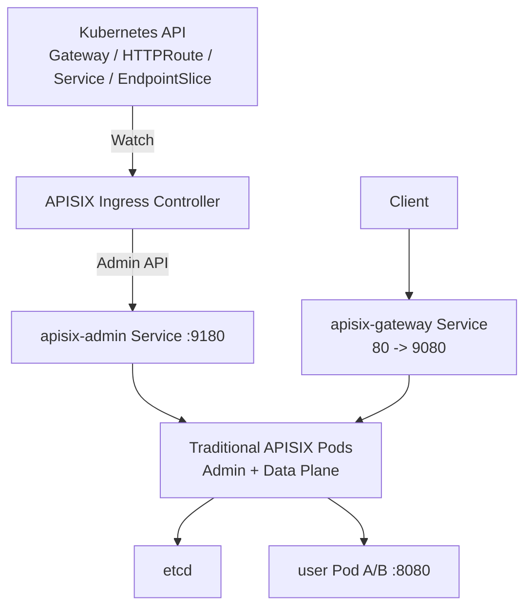
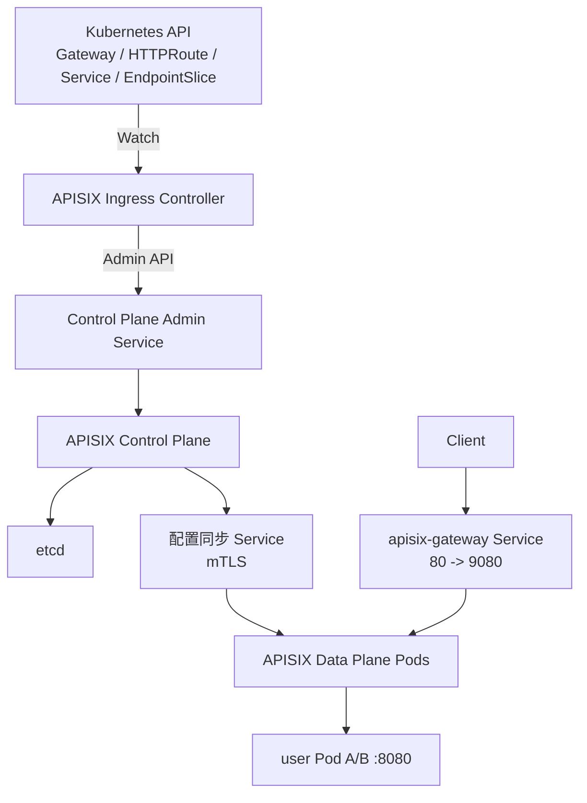

## 1. 先区分两个维度

理解 APISIX 与 Kubernetes Gateway API 时，最容易混淆的是“APISIX 如何部署”和
“网关配置如何声明”。它们是两个独立维度：

```text
APISIX Traditional / Hybrid
    = APISIX 管理面与数据面如何部署

Kubernetes Gateway API
    = Gateway、HTTPRoute 和 Backend 如何声明
```

因此，Gateway API 既可以接入 Traditional APISIX，也可以接入 Hybrid APISIX。
Gateway API 不会自动决定 APISIX 使用哪种部署模式。

本文使用如下业务示例：

```text
GET http://api.example.com/users/*
    → Kubernetes Service user-service:80
    → user Pod A/B:8080
```

## 2. APISIX 的两种运行拓扑

### 2.1 Traditional 模式

Traditional 模式中，同一组 APISIX 实例同时包含管理能力和数据面能力：

```text
Admin API / CI/CD / Controller
              ↓
        APISIX 实例
        ├── Admin API :9180
        ├── 读取 etcd
        └── Gateway :9080
              ↓
           Backend
```

核心配置关系是：

```yaml
deployment:
  role: traditional
  role_traditional:
    config_provider: etcd
  etcd:
    host:
      - http://etcd:2379
    prefix: /apisix

apisix:
  enable_admin: true
  node_listen: 9080
```

配置流和请求流分别是：

```text
配置流：Admin API -> etcd -> APISIX
请求流：Client -> APISIX -> Backend
```

这种模式组件少，适合本地开发、教学和规模较小的环境。它的代价是管理面和业务数据面
没有完全隔离：APISIX 实例既需要读取配置，也处理外部业务流量。

### 2.2 Hybrid / Decoupled 模式

Hybrid 也称 Decoupled 模式，将 APISIX 拆分为 Control Plane 和 Data Plane：

```text
Admin API / CI/CD / Controller
              ↓
        Control Plane
        ├── Admin API
        ├── 连接 etcd
        └── 发布配置
              ↓ 安全配置通道
        Data Plane A/B
        ├── 不开放 Admin API
        ├── 不直接访问 etcd
        └── 处理业务请求
              ↓
           Backend
```

Control Plane 的核心配置：

```yaml
deployment:
  role: control_plane
  role_control_plane:
    config_provider: etcd
  etcd:
    host:
      - http://etcd:2379
    prefix: /apisix
```

Data Plane 的核心配置关系：

```yaml
deployment:
  role: data_plane
  role_data_plane:
    config_provider: control_plane
    control_plane:
      host:
        - https://apisix-control-plane:<config-sync-port>

apisix:
  enable_admin: false
  node_listen: 9080
```

`<config-sync-port>`、证书字段和挂载路径应以部署所用 APISIX 版本为准。生产环境应使用
mTLS 保护 Control Plane 到 Data Plane 的配置通道。

Hybrid 模式下的两条链路是：

```text
配置流：Admin API -> Control Plane -> etcd -> Data Plane
请求流：Client -> Data Plane -> Backend
```

Data Plane 不需要 etcd 凭证，也不开放 Admin API。这样能够隔离管理权限，并允许多组
Data Plane 在不同网络或区域复用同一个 Control Plane。

### 2.3 两种模式对比

| 对比项 | Traditional | Hybrid / Decoupled |
| --- | --- | --- |
| Admin API | 与数据面位于同一组实例 | 只位于 Control Plane |
| etcd 访问 | APISIX 实例直接访问 | 只有 Control Plane 访问 |
| 业务请求 | 同一实例处理 | 只由 Data Plane 处理 |
| 配置同步 | APISIX watch etcd | Control Plane 发布给 Data Plane |
| 部署复杂度 | 较低 | 较高，需要配置安全同步通道 |
| 适用场景 | 开发、小规模环境 | 生产、多区域、管理面隔离 |

APISIX 还支持 Standalone/YAML 等配置来源。这解决的是“配置从 etcd、YAML 还是其他
控制面取得”，不等同于本文比较的管理面/数据面运行拓扑。

## 3. Kubernetes Gateway API 在其中负责什么

Kubernetes Gateway API 使用 CRD 声明入口和路由：

```text
GatewayClass
Gateway
HTTPRoute
Service / EndpointSlice
```

APISIX 本身不会直接读取 `HTTPRoute`。APISIX Ingress Controller 负责监听这些资源，
再生成 APISIX Route、Upstream 和 Plugin 配置：

```text
Kubernetes Gateway API
          ↓ Watch
APISIX Ingress Controller
          ↓ 写入管理端点
APISIX
```

这里有两个容易混淆的“控制面”：

| 组件 | 职责 |
| --- | --- |
| APISIX Ingress Controller | 把 Kubernetes 资源翻译为 APISIX 配置 |
| APISIX Control Plane | 在 Hybrid 模式中存储并向 Data Plane 发布配置 |

Ingress Controller 不处理业务请求，也不等同于 APISIX Hybrid Control Plane。

## 4. Traditional 模式接入 Kubernetes Gateway API

### 4.1 部署结构

Traditional 模式在 Kubernetes 中需要：

- etcd；
- Traditional APISIX Deployment；
- `apisix-admin` ClusterIP Service；
- `apisix-gateway` LoadBalancer 或 NodePort Service；
- APISIX Ingress Controller；
- Gateway API CRD。



### 4.2 GatewayProxy 指向 Traditional Admin API

`GatewayProxy` 告诉 Ingress Controller 将转换后的配置写到哪里：

```yaml
apiVersion: apisix.apache.org/v1alpha1
kind: GatewayProxy
metadata:
  name: apisix-traditional
spec:
  provider:
    type: ControlPlane
    controlPlane:
      endpoints:
        - http://apisix-admin.ingress-apisix.svc.cluster.local:9180
      auth:
        type: AdminKey
        adminKey:
          valueFrom:
            secretKeyRef:
              name: apisix-admin-key
              key: key
  statusAddress:
    - 203.0.113.10
```

这里的 `provider.controlPlane` 是 Controller 写入配置的管理端点。即使 APISIX 使用
Traditional 模式，该字段仍然叫 `controlPlane`；它不表示当前 APISIX 已经拆成 Hybrid。

`statusAddress` 只负责报告 `Gateway.status.addresses`，不会创建 IP、Service 或转发链路。

### 4.3 配置流和请求流

```text
配置流：
Gateway API -> Ingress Controller -> apisix-admin:9180 -> etcd -> APISIX

请求流：
Client -> apisix-gateway:80 -> APISIX Pod:9080 -> user Pod:8080
```

Traditional APISIX Pod 同时出现在两条链路中。

## 5. Hybrid 模式接入 Kubernetes Gateway API

### 5.1 部署结构

Hybrid 模式在 Kubernetes 中需要：

- etcd，只允许 Control Plane 访问；
- APISIX Control Plane Deployment；
- Control Plane Admin Service；
- Control Plane 配置同步 Service；
- APISIX Data Plane Deployment；
- Data Plane Gateway Service；
- APISIX Ingress Controller；
- Gateway API CRD 和 Control/Data Plane 间的 mTLS Secret。



### 5.2 GatewayProxy 只指向 Control Plane

```yaml
apiVersion: apisix.apache.org/v1alpha1
kind: GatewayProxy
metadata:
  name: apisix-hybrid
spec:
  provider:
    type: ControlPlane
    controlPlane:
      endpoints:
        - http://apisix-control-plane-admin.ingress-apisix.svc.cluster.local:9180
      auth:
        type: AdminKey
        adminKey:
          valueFrom:
            secretKeyRef:
              name: apisix-admin-key
              key: key
  statusAddress:
    - 203.0.113.10
```

与 Traditional 模式相比，Gateway、HTTPRoute 和业务 Service 可以完全相同。真正变化的
是 `GatewayProxy` 的管理端点和 APISIX 的运行拓扑：

```text
Traditional：Controller -> Traditional APISIX Admin API
Hybrid：     Controller -> Control Plane Admin API
```

Ingress Controller 不应该连接 Data Plane，Data Plane 也不应该暴露 Admin API。

### 5.3 配置流和请求流

```text
配置流：
Gateway API
  -> Ingress Controller
  -> Control Plane Admin API
  -> etcd
  -> Control Plane 配置同步
  -> Data Plane

请求流：
Client
  -> apisix-gateway:80
  -> Data Plane Pod:9080
  -> user Pod:8080
```

Control Plane 不处理正常业务流量，Data Plane 不读取 Kubernetes Gateway API。

## 6. 两种模式共用的 Gateway API 资源

### 6.1 GatewayClass 选择 APISIX Controller

```yaml
apiVersion: gateway.networking.k8s.io/v1
kind: GatewayClass
metadata:
  name: apisix
spec:
  controllerName: apisix.apache.org/apisix-ingress-controller
```

### 6.2 Gateway 引用对应的 GatewayProxy

```yaml
apiVersion: gateway.networking.k8s.io/v1
kind: Gateway
metadata:
  name: apisix
spec:
  gatewayClassName: apisix
  listeners:
    - name: http
      protocol: HTTP
      port: 80
  infrastructure:
    parametersRef:
      group: apisix.apache.org
      kind: GatewayProxy
      name: apisix-traditional
```

使用 Hybrid 时，只需将 `parametersRef.name` 改成 `apisix-hybrid`。Gateway 本身不会创建
APISIX Deployment、Service 或监听端口。

### 6.3 HTTPRoute 声明匹配条件和后端

```yaml
apiVersion: gateway.networking.k8s.io/v1
kind: HTTPRoute
metadata:
  name: user-api
spec:
  parentRefs:
    - name: apisix
      sectionName: http
  hostnames:
    - api.example.com
  rules:
    - matches:
        - path:
            type: PathPrefix
            value: /users
      backendRefs:
        - name: user-service
          port: 80
```

`parentRefs` 把 Route 绑定到 Gateway 的 `http` Listener，`backendRefs` 指向 Kubernetes
Service。Traditional 与 Hybrid 使用相同的 HTTPRoute。

## 7. APISIX 如何得到后端 Pod

```text
HTTPRoute.backendRefs: user-service:80
        ↓
Ingress Controller 读取 Service 和 EndpointSlice
        ↓
得到 10.0.1.11:8080、10.0.2.12:8080
        ↓
生成 APISIX Route 和 Upstream
        ↓
写入 Traditional APISIX 或 Hybrid Control Plane
        ↓
最终由数据面在 Pod IP 之间负载均衡
```

服务扩容后，EndpointSlice 变化会触发 Controller 更新 Upstream。APISIX 自身也支持
Kubernetes Service Discovery Plugin；这是 APISIX 数据面主动发现后端的另一条路径，
不要和 Ingress Controller 转换 EndpointSlice 的过程混在一起。

## 8. Gateway、Service 和 APISIX 监听端口

| 端口 | 示例 | 作用 |
| --- | --- | --- |
| `Gateway.listeners.port` | 80 | Gateway API 声明的 Listener |
| `apisix-gateway Service.port` | 80 | Client 实际访问的端口 |
| Service `targetPort` | 9080 | 转发到 APISIX Data Plane |
| APISIX `node_listen` | 9080 | APISIX 进程实际监听端口 |
| Admin Service | 9180 | Controller 写配置，不承载业务请求 |

典型请求路径是：

```text
Client -> 203.0.113.10:80 -> Service:80 -> APISIX:9080 -> Backend
```

如果启用 APISIX Controller 的 Listener 端口匹配，应保证 Gateway Listener、Service
端口映射和 APISIX 实际监听规则一致，否则 Route 可能因为端口条件不匹配而返回 `404`。

## 9. Dashboard 与两种模式的关系

Dashboard 是管理界面，不是第三种 APISIX 部署模式：

```text
Traditional：Dashboard -> Traditional APISIX Admin API
Hybrid：     Dashboard -> Control Plane Admin API
```

Dashboard 不处理业务请求。在 Hybrid 模式中，它不能连接 Data Plane；生产环境还应限制
Admin API 只能被 Dashboard、Ingress Controller、CI/CD 和可信管理网络访问。

## 10. 当前 Docker 实验的位置

当前 `deployments/gateway/003_apisix` 使用 Traditional 模式：

```text
Admin API :9180 ─┐
                 ├─> APISIX -> etcd :2379
Gateway :8080 ───┘
```

当前实验使用 Admin API 创建 Route 和 Upstream，还没有接入 Kubernetes Gateway API。
后续 Kubernetes 实验可以按以下顺序展开：

1. 部署 Traditional APISIX 与 Ingress Controller，验证 Gateway/HTTPRoute；
2. 将 APISIX 拆分成 Control Plane 与 Data Plane；
3. 让同一份 Gateway/HTTPRoute 改为写入 Hybrid Control Plane；
4. 验证 Data Plane 不访问 etcd、没有 Admin API，仍然可以转发业务请求。

## 11. 总结

```text
Traditional / Hybrid
    决定 APISIX 管理面和数据面如何部署

Gateway API
    决定入口、路由和后端如何声明

Ingress Controller
    把 Gateway API 翻译成 APISIX 配置
```

Traditional 下 Controller 写入同一组 APISIX；Hybrid 下 Controller 只写 Control Plane，
业务请求只经过 Data Plane。二者使用相同的 Gateway 和 HTTPRoute 语义。

官方文档：[Deployment Architecture](https://apisix.apache.org/docs/ingress-controller/concepts/deployment-architecture/)、[Gateway API Support](https://apisix.apache.org/docs/ingress-controller/concepts/gateway-api/)、[Configuration Examples](https://apisix.apache.org/docs/ingress-controller/reference/apisix-ingress-controller/examples/)、[Kubernetes Discovery](https://apisix.apache.org/docs/apisix/discovery/kubernetes/)。
