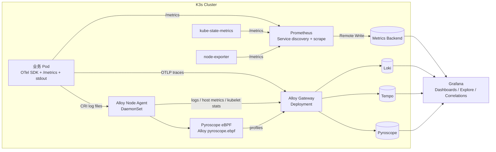

上一篇文章给出了组件选型，本文把它收敛成一套可以部署在 K3s 上的方案。目标不是让一个 Agent 包办所有事情，而是让每类信号沿着清晰、可替换的链路进入合适的后端：

```text
Metrics：应用/K8s 组件 --/metrics--> Prometheus --Remote Write--> Metrics Backend
Logs：应用 stdout/stderr --> CRI 日志文件 --> Node Agent --> Gateway --> Log Backend
Traces：应用 OTel SDK --OTLP--> Collector Gateway --> Trace Backend
节点数据：host metrics / kubelet stats / 节点日志 --> Node Agent --> Gateway 或对应后端
```

本文选择 Grafana 生态作为参考实现，并额外加入 Pyroscope 的 eBPF Agent。它适合单节点或少量节点的 K3s 学习、开发和内部环境；生产环境只需要把后端的本地存储替换为对象存储，并提高副本数。

<!-- more -->

## 1. 推荐的最终拓扑



这里有两个容易混淆的点：

1. `Prometheus` 专门负责发现和抓取 `/metrics`，不会因为部署了 Alloy 就自动替代 Prometheus。
2. Alloy 以 DaemonSet 运行时是 Node Agent，以 Deployment 运行时是 Gateway。它们是同一个产品的两种部署角色，不是同一个实例。

## 2. 组件和职责

| 组件 | K3s 部署方式 | 主要职责 | 数据去向 |
|---|---|---|---|
| Prometheus | StatefulSet | 抓取应用、K8s 组件、kube-state-metrics 和 node-exporter | 本地 TSDB，可选 Remote Write |
| Alloy Node Agent | DaemonSet | 读取 `/var/log/pods`、节点指标、kubelet stats；运行 Pyroscope eBPF | Alloy Gateway 或后端 |
| Alloy Gateway | Deployment | 接收 OTLP 和 Node Agent 数据，统一补充属性、批处理、路由 | Loki、Tempo、Pyroscope |
| Loki | StatefulSet/单体模式 | 存储日志 | Grafana LogQL |
| Tempo | StatefulSet/单体模式 | 存储 Trace | Grafana TraceQL |
| Pyroscope | StatefulSet/单体模式 | 存储 CPU、内存和 eBPF Profile | Grafana Flame Graph |
| Grafana | Deployment | 统一查询和关联 Metric、Log、Trace、Profile | 四个数据源 |

K3s 默认使用 containerd，Pod 日志仍然位于节点的 `/var/log/pods`；K3s 自身的 containerd 日志通常位于 `/var/lib/rancher/k3s/agent/containerd/containerd.log`。因此 Node Agent 必须挂载这些主机路径，并根据实际节点检查是否启用了 journald 或自定义 `podLogsDir`。[K3s FAQ](https://docs.k3s.io/faq) 和 [Kubernetes Logging Architecture](https://kubernetes.io/docs/concepts/cluster-administration/logging/) 对这些边界有说明。

## 3. 在 K3s 上安装基础组件

以下命令假设已经配置好 `kubectl` 和 `helm`，并使用 `observability` 命名空间。版本号建议在自己的环境中固定，不要直接使用 `latest`。

```bash
kubectl create namespace observability

helm repo add prometheus-community https://prometheus-community.github.io/helm-charts
helm repo add grafana https://grafana.github.io/helm-charts
helm repo update
```

先安装 Prometheus 和 Kubernetes 基础指标：

```bash
helm upgrade --install prometheus prometheus-community/kube-prometheus-stack \
  --namespace observability \
  --set grafana.enabled=false \
  --set prometheus.prometheusSpec.retention=7d \
  --set prometheus.prometheusSpec.resources.requests.cpu=200m \
  --set prometheus.prometheusSpec.resources.requests.memory=512Mi
```

这个 Chart 会提供 Prometheus Operator、Prometheus、Alertmanager、kube-state-metrics 和 node-exporter。小型 K3s 可以先保留 Prometheus 本地 TSDB；多集群或长周期场景再配置 `remoteWrite` 到 VictoriaMetrics、Mimir 或云厂商 Metrics Backend：

```yaml
prometheus:
  prometheusSpec:
    remoteWrite:
      - url: https://metrics.example.com/api/v1/push
        # headers、tlsConfig 和 basicAuth 按后端要求配置
```

再安装后端。下面是实验环境的单体模式示意；Loki、Tempo、Pyroscope 的数据目录必须使用 PVC，生产环境应改用 S3、MinIO 或兼容对象存储：

```bash
helm upgrade --install loki grafana/loki --namespace observability \
  --set deploymentMode=SingleBinary \
  --set loki.auth_enabled=false

helm upgrade --install tempo grafana/tempo --namespace observability

helm upgrade --install pyroscope grafana/pyroscope --namespace observability

helm upgrade --install grafana grafana/grafana --namespace observability \
  --set persistence.enabled=true
```

不同 Chart 版本的 `values.yaml` 字段会变化，安装前应使用 `helm show values` 校验字段；这里的关键不是记住某个字段，而是确保三个后端分别暴露 Loki、OTLP/Tempo、Pyroscope 接收地址。

## 4. Alloy Gateway：集中接收和路由

Gateway 使用 Deployment，至少运行两个副本，并通过 ClusterIP Service 暴露 OTLP gRPC `4317`、OTLP HTTP `4318`。它不挂载节点日志目录，也不需要 `privileged`。

配置逻辑可以抽象成下面这样：

```text
OTLP receiver
  ├─ traces -> batch -> Tempo exporter
  ├─ logs   -> batch -> Loki exporter
  └─ profiles -> batch -> Pyroscope exporter

Node Agent
  ├─ logs -> Gateway 的 OTLP logs
  ├─ host/kubelet metrics -> Metrics Backend 或 Prometheus-compatible endpoint
  └─ profiles -> Gateway 的 profiles endpoint
```

业务应用只需要把 OTLP 地址指向 Service，例如：

```yaml
env:
  - name: OTEL_SERVICE_NAME
    value: order-api
  - name: OTEL_EXPORTER_OTLP_ENDPOINT
    value: http://alloy-gateway.observability.svc.cluster.local:4317
```

Gateway 应统一做以下处理：

- 使用 `k8sattributes` 补充 namespace、pod、node、container、deployment 等 Resource 属性；
- 使用 `memory_limiter` 和 `batch`，避免突发流量直接冲垮后端；
- 对日志做 CRI 解析和敏感字段脱敏；
- 对 Trace 配置 tail sampling 时，保证所有同一 Trace 的 Span 能进入同一个采样决策；
- 对不同租户或环境通过 `cluster`、`environment`、`tenant` 等低基数字段路由。

如果采用 Alloy Flow 配置，日志和 Trace 的核心组件分别对应 `loki.source`、`otelcol.receiver.otlp`、`otelcol.processor.batch` 和 `otelcol.exporter.otlp`。后端 URL 以实际 Helm Service 名称为准，先用 `kubectl get svc -n observability` 验证，不要把示例 Service 名称直接当成固定事实。

## 5. Alloy Node Agent：日志、节点数据和 eBPF Profile

Node Agent 以 DaemonSet 部署，每个节点一个实例。它需要挂载：

```yaml
volumeMounts:
  - name: pods-log
    mountPath: /var/log/pods
    readOnly: true
  - name: containers-log
    mountPath: /var/log/containers
    readOnly: true
  - name: host-proc
    mountPath: /host/proc
    readOnly: true
  - name: host-sys
    mountPath: /sys
    readOnly: true
  - name: bpf
    mountPath: /sys/fs/bpf

securityContext:
  privileged: true
hostPID: true
```

日志采集遵循 CRI 链路：读取 `/var/log/pods/**/*.log`，解析 CRI 的时间戳、流类型和日志正文，再从文件路径或 Kubernetes API 补充 namespace、pod、container 和 node 标签。不要把完整日志正文放进 Loki label；高基数 label 会让日志后端的索引和查询成本失控。

节点指标可以使用 Alloy 的 `prometheus.exporter.unix` 或 `hostmetrics`，kubelet/container stats 则使用 kubelet stats 接口。指标也可以直接 remote write 到 Metrics Backend，但要避免和 Prometheus 重复抓取同一批 kubelet/cAdvisor 指标。

### 5.1 Pyroscope eBPF Agent

Pyroscope eBPF Agent 不是一个独立的“万能监控器”，这里使用 Alloy 的 `pyroscope.ebpf` 组件。它在当前节点收集进程的 CPU 栈，并通过 `pyroscope.write` 发往 Pyroscope。官方组件要求 target 中包含容器 ID 或进程 PID，并支持 Go、Python、Node.js/V8、JVM、PHP、Ruby 等运行时。[pyroscope.ebpf 参考](https://grafana.com/docs/alloy/latest/reference/components/pyroscope/pyroscope.ebpf/)

典型配置逻辑如下：

```alloy
discovery.kubernetes "local_pods" {
  role = "pod"
  selectors {
    field = "spec.nodeName=" + sys.env("HOSTNAME")
    role  = "pod"
  }
}

discovery.relabel "profile_targets" {
  targets = discovery.kubernetes.local_pods.targets

  rule {
    action        = "replace"
    source_labels = ["__meta_kubernetes_namespace", "__meta_kubernetes_pod_container_name"]
    separator     = "/"
    target_label  = "service_name"
  }
  rule {
    action        = "replace"
    source_labels = ["__meta_kubernetes_pod_container_id"]
    target_label  = "__container_id__"
  }
}

pyroscope.ebpf "k3s" {
  targets                     = discovery.relabel.profile_targets.output
  forward_to                  = [pyroscope.write.backend.receiver]
  collect_interval            = "15s"
  sample_rate                 = 19
  obi_process_context_enabled = true
}

pyroscope.write "backend" {
  endpoint {
    url = "http://pyroscope.observability.svc.cluster.local:4040"
  }
}
```

实际部署时还要确认 Alloy Chart 把 `hostPID`、`privileged`、`/proc`、`/sys/kernel`、`/lib/modules` 和 `/sys/fs/bpf` 挂载到了容器内对应位置，并给 ServiceAccount 配置读取 Pod、Namespace、Node 的 RBAC。eBPF 对 Linux 内核、架构和权限敏感；K3s 节点应优先使用支持 eBPF 的 amd64/arm64 Linux 内核。[Alloy Kubernetes 权限说明](https://grafana.com/docs/alloy/latest/access_permissions/kubernetes/)

如果只想验证 eBPF Agent，不想一开始接入业务 SDK，可以先使用官方的 OTel eBPF Profiler 示例。但该方案目前仍需要严格匹配 profiler、Collector 和 Pyroscope 版本，官方文档将其定位为开发和测试场景；长期运行前应做内核、权限和符号解析验证。[OpenTelemetry eBPF Profiler](https://grafana.com/docs/pyroscope/latest/configure-client/opentelemetry/ebpf-profiler/)

## 6. 四条链路如何验收

部署完成后，不要只看 Pod 是 `Running`，而要逐条验证数据是否真正到达后端：

```bash
# 组件和 Service
kubectl get pods,svc -n observability

# Prometheus 是否发现并抓取目标
kubectl port-forward -n observability svc/prometheus-operated 9090:9090

# 查看 Alloy Node Agent / Gateway 错误
kubectl logs -n observability daemonset/alloy --tail=100
kubectl logs -n observability deployment/alloy-gateway --tail=100

# 验证节点上确实存在 CRI 日志
sudo find /var/log/pods -name '*.log' | head
```

验收标准是：

| 链路 | 最小验证 |
|---|---|
| Metrics | Prometheus Targets 为 `UP`，能查询 `up`、节点 CPU 和 Pod 重启次数 |
| Logs | 在 Grafana Explore 用 `{namespace="default"}` 查到业务 stdout，并能按 pod 过滤 |
| Traces | 发起一次业务请求，在 Tempo 中看到完整 Trace 和跨服务 parent-child 关系 |
| Profiles | Pyroscope 中出现 `service_name`，能打开 CPU 火焰图 |
| 关联 | 从 Trace 跳到对应日志或 Profile；至少保证 `service.name`、`service.instance.id`、`k8s.pod.uid` 一致 |

## 7. 资源和安全边界

K3s 的轻量不代表可观测性后端没有成本。建议按下面的顺序逐步启用：

1. 单节点学习环境：Prometheus + Grafana + Alloy Node Agent，先验证 Metrics 和 Logs。
2. 加入业务 OTel SDK，再启用 Tempo，验证 Trace Context 传播。
3. 启用 Pyroscope eBPF，先把采样频率和目标限制在少量命名空间。
4. 最后增加 Loki、Tempo、Pyroscope 的保留策略、对象存储和高可用副本。

必须特别控制三类风险：

- eBPF Agent 通常需要 `hostPID` 和较高 Linux 权限，应通过专用 ServiceAccount、节点选择器和 NetworkPolicy 限制范围；
- 日志正文可能包含 Token、Cookie、手机号和业务数据，Gateway 侧应先脱敏再落盘；
- Trace、Log、Profile 的关联标签应保持低基数，动态 ID 放在字段或 Trace 属性中，不要全部提升为索引标签。

## 8. 最终推荐

对于一套小型 K3s 集群，我会采用下面的默认分工：

```text
Metrics：kube-prometheus-stack 中的 Prometheus
         -> 本地 Prometheus TSDB
         -> 可选 Remote Write 到 VictoriaMetrics/Mimir

Logs：Alloy Node Agent DaemonSet
      -> CRI /var/log/pods
      -> Alloy Gateway
      -> Loki

Traces：应用 OTel SDK
        -> Alloy Gateway OTLP 4317/4318
        -> Tempo

节点数据：Alloy Node Agent
          -> host metrics / kubelet stats / K3s 日志
          -> 对应 Metrics、Logs 后端

Profiles：Alloy Node Agent
          -> pyroscope.ebpf
          -> Pyroscope
          -> Grafana 火焰图
```

这套方案的关键价值是边界清晰：Prometheus 不被日志和 Trace 采集拖累，Node Agent 靠近节点数据源，Gateway 负责集中策略，Pyroscope eBPF 负责回答“哪个进程、哪个函数消耗了 CPU”。当数据量增长时，可以独立替换 Metrics、Logs、Traces 或 Profiles 后端，而不需要重写应用埋点和整套采集拓扑。

